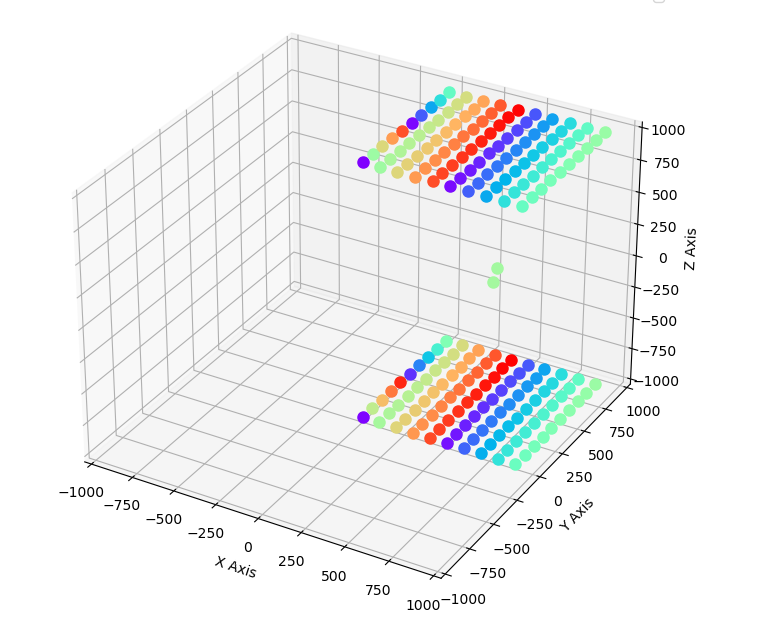

# Bicycle Racing Simulation
This repository provides C++ simulations for analyzing the behavior of a parallel-plate capacitor, focusing on how charged particles interact within the electric field between the plates. The simulations allow you to create a `Capacitor` object, configure its properties, and observe the dynamics of particles placed inside the capacitor. Results are output to CSV files and can be visualized using a Python script to better understand the influence of the electric field on particle motion.

## Introduction

Capacitors are fundamental components in electronics, storing energy in the electric field between two conductive plates. When charged particles are introduced between the plates, they experience forces due to the uniform electric field, resulting in predictable motion governed by classical physics.

This repository includes two C++ simulations:

1. **capacitor_particles.cpp**: Simulates the motion of a single charged particle between the plates of a capacitor, allowing you to analyze its trajectory under the influence of the electric field.

## System Behavior

### 1. **Single Particle Simulation (simulate.cpp)**

- A `Capacitor` object is created with configurable plate separation, area, and applied voltage.
- A charged particle (e.g., electron or ion) is placed between the plates with an initial position and velocity.
- The simulation computes the force on the particle due to the electric field and updates its motion over time.
- The particle's trajectory is recorded, showing how it accelerates toward the oppositely charged plate.

## Folder Structure

```
capacitor_simulation/
│
├── capacitor_particles.cpp         # Single particle simulation
├── plot_capacitor_particles.py     # Python script to plot results
└── README.md                       # This file
```

### C++ Simulations

1. **capacitor_particles.cpp**: Models the motion of a single charged particle in a uniform electric field between capacitor plates. Outputs position and velocity data to `capacitor_particles.dat`.
2. **capacitor_particles_multi.cpp**: Simulates multiple particles, optionally including inter-particle interactions. Outputs data to `capacitor_particles_multi.dat`.

Both simulations use basic physics: the electric field \( E = V/d \) (where \( V \) is voltage and \( d \) is plate separation), and the force on a particle \( F = qE \).

### Python Visualization

- **plot_capacitor_particles.py**: Reads the output CSV files and generates plots of particle positions and velocities over time using `matplotlib`.




## Getting Started

### Prerequisites

- C++ compiler (e.g., `g++`)
- Python 3.x
- Required Python libraries:

    ```bash
    pip install matplotlib
    ```

### Running the Simulations

1. **Build and Run C++ Simulations**:

     ```bash
     g++ capacitor_particles.cpp -o capacitor_particles
     ./capacitor_particles
     ```

     For the multi-particle simulation:

     ```bash
     g++ capacitor_particles_multi.cpp -o capacitor_particles_multi
     ./capacitor_particles_multi
     ```

     These commands generate `capacitor_particles.dat` or `capacitor_particles_multi.dat`.

2. **Plot the Results**:

     ```bash
     python plot_capacitor_particles.py
     ```

     This will visualize the motion of particles inside the capacitor.

### Output Files

- **capacitor_particles.dat**: CSV file with position and velocity data for the single particle simulation.
- **capacitor_particles_multi.dat**: CSV file with data for the multi-particle simulation.

## Example Output

After running the Python script, you will see plots showing how charged particles move under the influence of the capacitor's electric field, including acceleration and possible impacts with the plates.

## License

This project is licensed under the MIT License - see the [LICENSE](LICENSE) file for details.
