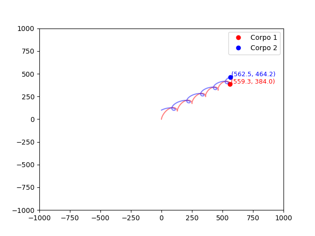

# Two-Body Simulation

## Overview
This project simulates the interaction between two charged particles under the influence of Coulomb's law. It numerically integrates their motion using Newton's second law and updates their velocities and positions over time.

## Features
- Simulates electric forces between two charged particles.
- Uses Coulomb's law to calculate forces.
- Updates positions and velocities using numerical integration.
- Outputs data for visualization.

## Dependencies
This project requires:
- C++17 or later
- A linear algebra library supporting vector operations (or a custom `Vector<double, 3>` implementation)

## Compilation
To compile the project, use:
```sh
 g++ -std=c++17 main.cpp -o simulation
```

## Usage
Run the simulation with:
```sh
 ./two_body_problem
```
The output will be stored in a file for visualization.

## Equations Used
The force between two charged bodies follows Coulomb's law:

\[
\mathbf{F} = k \frac{|q_1 q_2|}{r^2} \hat{r}
\]

where:
- \( k = 8.99 \times 10^9 \) Nm²/C² (Coulomb's constant)
- \( q_1, q_2 \) are the charges of the bodies
- \( r \) is the distance between the bodies
- \( \hat{r} \) is the unit vector in the direction of the force

Acceleration is computed as:
\[
\mathbf{a} = \frac{\mathbf{F}}{m}
\]

## Example Output
The simulation generates a CSV file with position data:
```
x1,y1
x2,y2
...
```

This data can be used for animation or graph plotting.



2. **Plot the Results**:

   After running the simulations and generating the `.dat` files, you can visualize the results using the Python script.

   ```bash
   python3 plot_electron.py
   ```

## License
This project is released under the MIT License.

